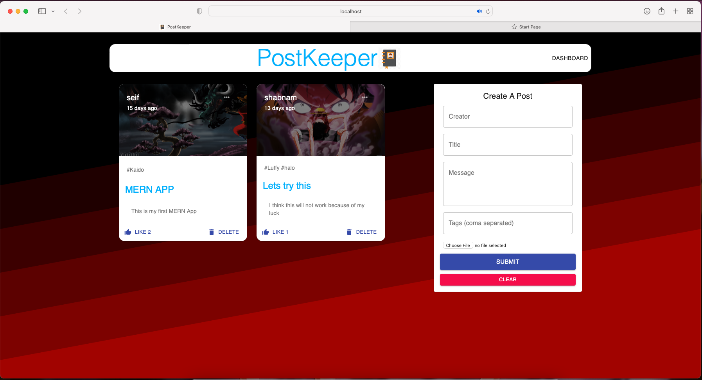

# PostKeeper

## About the App

This app is called Postkeeper and it is an app that allows for creating personal posts and storing them in a MongoDB database.

Developed the backend using Node.js, Express.js, and MongoDB, and the frontend using React

The application components included Form, Posts, Post and Menu. The frontend retrives all the post data from the MongoDB database using Axios. 

## To Do

/*
  - Add Add Login and Authentication
  - Add functionality to the Menu component
 */
